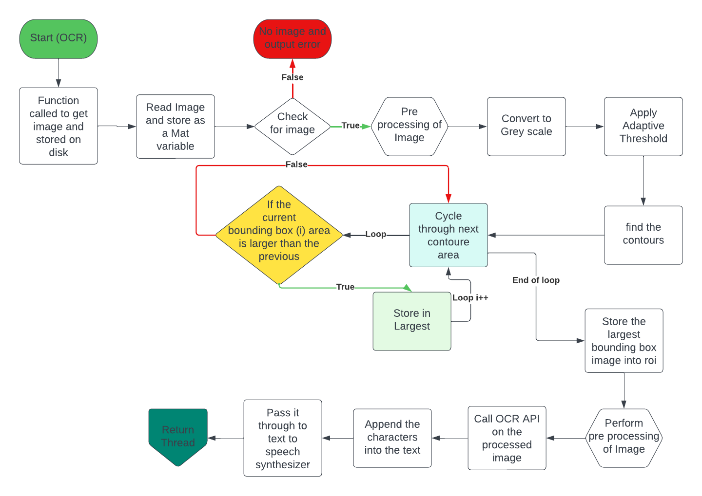

# Embedded-Iris

---------------------------------------------------------------------------

<p align="center">

</p>


Welcome to our course project for the Embedded Lab! Our goal is to assist the visually imapired in their daily lives. We created a novel wearable that combines a Raspberry Pi 3, a camera, and a speaker to provide text-to-speech functionality and real-time object identification and clasificaition.

Our device can presently recognise objects and text in real-time buy using CV library along with OCR in addition to identify objects. The prototype code can be used to recognise text, for instance during grocery shopping the prototype can recognise text and provide a text to speech output for the user which can identify the item name. Further functions are added and described in detail as below.

We're committed to make our product as simple and user-friendly as we can in order to enhance quality of life.


---------------------------------------------------------------------------

## Software Dependencies

- [Raspberry Pi OS](https://www.raspberrypi.com/software/)
- [CMake](https://cmake.org/download/)
- [OpenCV](https://opencv.org/releases/)
- [WiringPi](http://wiringpi.com/download-and-install/)
- Tesseract and its dependencies
- eSpeak


## Installation and usage

Once the required software is installed, follow these steps:

- Clone the repo
```git
git clone https://github.com/NavneetKanna/Embedded-Iris.git
```

- Open the 'Embedded-Iris' folder and run CMake
```bash
cd Embedded-Iris
mkdir build
cd build
cmake ..
make
```

- If everything was successful run the executable 
```bash
./embeddediris
```

---------------------------------------------------------------------------

## Real-Time Coding

To ensure that our project is responsive in real-time, we have implemented interrupts and callbacks. Specifically, for each button in our project, we have set up an interrupt that utilizes a callback function to invoke the relevant methods.

To achieve this, we are using a routine called wiringPiISR() from the wiringPi library. Here is an example usage where we set up an interrupt for GPIO pin 8 that triggers when the button is pushed and calls the start_ocr() function:

```cpp
wiringPiISR(8, INT_EDGE_RISING, start_ocr);
```

Moreover, to maintain a robust and flexible codebase, we have applied the SOLID design principles. This means that each class in our project has only one responsibility, and new functions can be added without needing to modify the existing code. This approach allows us to easily extend and modify our code as needed, making it more maintainable and less error-prone in the long run.

---------------------------------------------------------------------------
##OCR Function
The aim of the OCR function is to read the text from an image that is captured from the instruction of the user. The aim of the function is to read out the labels, ingrediants and allergens. At present we have acheived label detection and further processing is required to locate ingredients and allergens. The detailed flowchart is as follows

<p align="center">

</p>


## Components List


### Raspberry Pi 

<p align="center">

</p>
The Raspberry Pi 3 Model B+ is the final revision in the Raspberry Pi 3 range.
Broadcom BCM2837B0, Cortex-A53 (ARMv8)
64-bit SoC @ 1.4GHz
1GB LPDDR2 SDRAM
2.4GHz and 5GHz IEEE 802.11.b/g/n/ac wireless
LAN, Bluetooth 4.2, BLE
Gigabit Ethernet over USB 2.0 (maximum throughput 300 Mbps)
Extended 40-pin GPIO header
Full-size HDMI
4 USB 2.0 ports
CSI camera port for connecting a Raspberry Pi camera
DSI display port for connecting a Raspberry Pi touchscreen display
4-pole stereo output and composite video port
Micro SD port for loading your operating system and storing data
5V/2.5A DC power input
Power-over-Ethernet (PE) support (requires separate PoE HAT)


### Raspberry Pi Camera Module


<!---->

<p align="center">

</p>

Sensor: Sony IMX708
Resolution: 11.9 megapixels
Sensor size: 7.4mm sensor diagonal
Pixel size: 1.4um × 1.4um
Horizontal/vertical: 4608 × 2592 pixels
Common video modes: 1080p50, 720p100, 480p120
Output: RAW10
IR cut filter: Integrated
Autofocus system: Phase Detection Autofocus
Dimensions: 25 × 24 × 11.5mm (12.4mm height for Wide variants)
Standard
Effective focal length 4.74mm
f/1.8
Diagonal field of view 75 degrees (at 16:9)
35mm equivalent focal length roughly 28mm (full width) - 30mm (3:2 crop)
Focus 10cm - infinity

#### Usage 
Used for the following functions
1) OCR
2) Object Detection


### Speaker


<!--  -->

<p align="center">

</p>

Plug and Play Audio Amplifier has a class D audio amplifier on board and little 1 Watt 8 ohm speaker


### Ultrasonic Sensor


<!-- -->

<p align="center">

</p>

Input Voltage: 5V
Current Draw: 20mA (Max)
Digital Output: 5V
Digital Output: OV (LOW)
Working Temperature: -15°C to 70°C
Sensing Angle: 30° Cone
Angle of Effect: 15° Cone
Ultrasonic Frequency: 40kHz
Range: 2cm - 400cm
Dimensions
Length: 43mm
Width: 20mm
Height (with transmitters): 15mm
Centre screw hole distance: 40mm × 15mm
Screw hole diameter: 1mm (M1)
Transmitter diameter: 8mm


#### Usage
1) Obstacle Detection

### Tactile Switch Buttons
Dimension: 12 x 6

#### Usage 
1) Fucntion Calling
2) Power Off

-----------------------------------------------------------------------------------


### Social Media

<!-- Needed to display sideways -->

<!-- display the social media buttons in your README -->

[![alt text][1.1]][1]
[![alt text][2.1]][2]

<!-- icons with padding -->

[1.1]: https://github.com/NavneetKanna/Embedded-Iris/blob/Documentation/Images/instagramm.png?raw=true (instagram logo)
[2.1]: https://github.com/NavneetKanna/Embedded-Iris/blob/Documentation/Images/youtube.png?raw=true (facebook logo)


<!-- links to your social media accounts -->
<!-- update these accordingly -->

[1]: https://www.instagram.com/_embedded_iris_/
[2]: https://www.youtube.com/@sisinsaju3942http://www.facebook.com/sednaoui

<!-- Needed to display sideways-->
